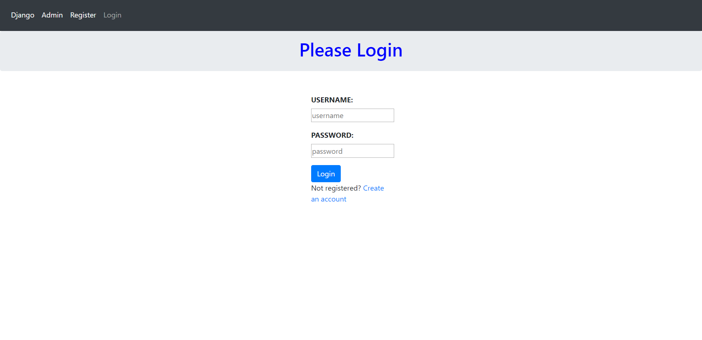
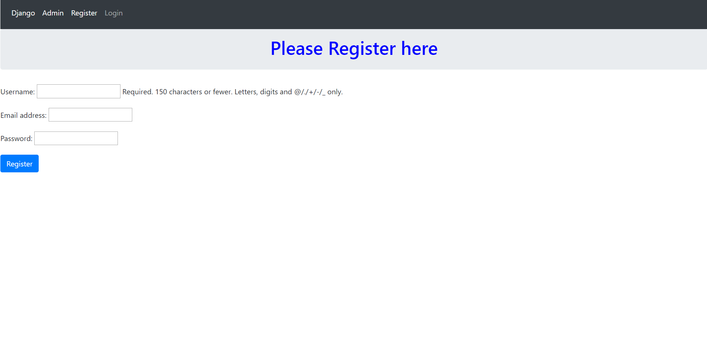
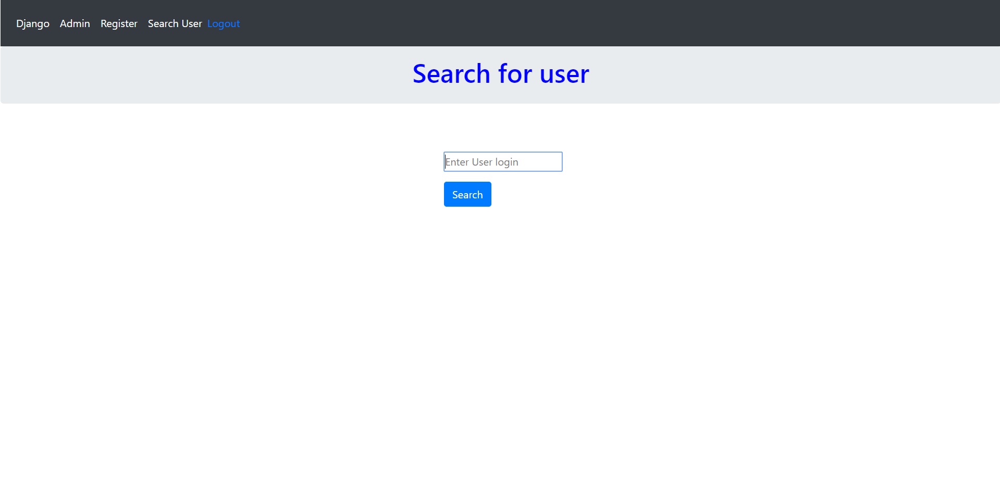
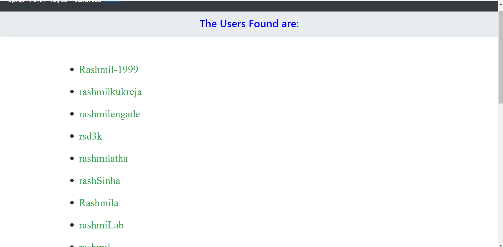
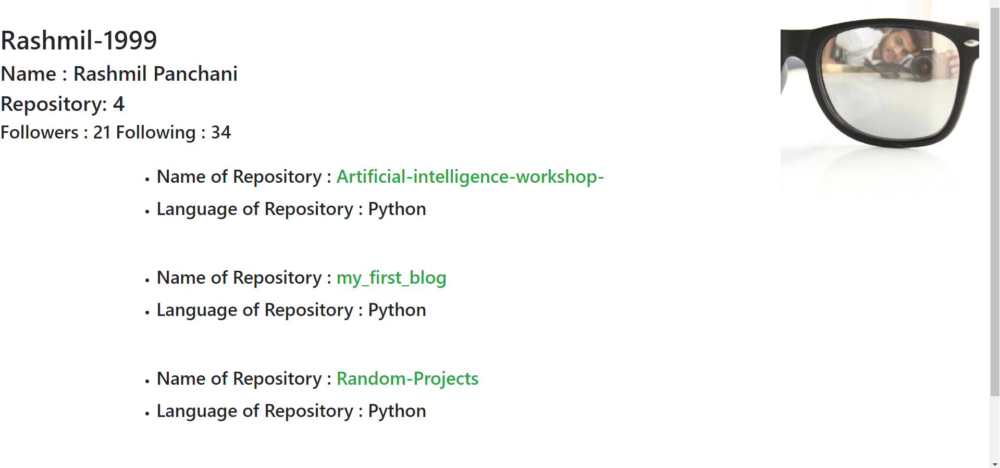

# FIRST TASK
```
The is a project that uses GIT HUB REST API v3 to get information about particular user by registered users. Search for a username and you will get all the data about their repositories along with the commit history of the repository.
```
## Prerequisites

Things you need to install and how to install them

```
pip install django
pip install request
pip install bcrypt
```

## File Structure

```
.
├── screenshots
├── retriever
        ├──git_app
        ├──retriever
        ├──static
        ├──templates
        └── manage.py
├── README.md
└── requirements.txt
```
## Build Instructions
```
cd retriever
python manage.py makemigrations
python manage.py migrate
python manage.py runserver
```

## ScreenShots





